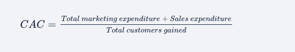

# End-to-end MLOps pipeline for an EDTech Project
In the previous modules where you learnt end-to-end MLOps pipeline for customer churn case study using the architecture shown below. 

## Business Context
CodePro is an EdTech startup that had a phenomenal seed A funding round. 
It used the money to increase its brand awareness. As the marketing spend increased, it got several leads from different sources. Although it had spent significant money on acquiring customers, it had to be profitable in the long run to sustain the business. 
The major cost that the company is incurring is the customer acquisition cost (CAC).

At the initial stage, customer acquisition cost is required to be high in companies. But as their businesses grow, these companies start focussing on profitability. Many companies first offer their services for free or provide offers at the initial stages but later start charging customers for these services

## Architecture

## Airflow + MLFlow = End-to-end pipeline

